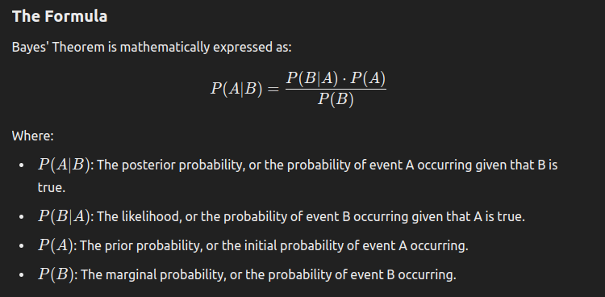

### **Bayes' Theorem Overview**

Bayes' Theorem is a fundamental theorem in probability theory that describes how to update the probability of a hypothesis based on new evidence. It’s widely used in various fields, including NLP, especially in classification problems.

### **Intuitive Explanation**
Bayes' Theorem allows us to update our belief about the probability of an event (A) after considering new evidence (B).

### **Example: Spam Email Classification**

Let’s consider a simple example where we want to classify emails as "Spam" or "Not Spam" based on the presence of certain words.

#### **Step 1: Define Events**
- **Event A**: The email is Spam.
- **Event B**: The word "Discount" appears in the email.

#### **Step 2: Gather Probabilities**
Assume the following probabilities based on past data:
- **\( P(A) \)**: Probability that any given email is Spam. (e.g., \( P(Spam) = 0.3 \))
- **\( P(B|A) \)**: Probability that the word "Discount" appears in a Spam email. (e.g., \( P(Discount | Spam) = 0.7 \))
- **\( P(B) \)**: Probability that the word "Discount" appears in any email. (e.g., \( P(Discount) = 0.4 \))

#### **Step 3: Apply Bayes' Theorem**
We want to find the probability that an email is Spam given that it contains the word "Discount" (\( P(Spam | Discount) \)).

\[
P(Spam|Discount) = \frac{P(Discount|Spam) \cdot P(Spam)}{P(Discount)} = \frac{0.7 \cdot 0.3}{0.4} = 0.525
\]

So, the probability that an email is Spam given that it contains the word "Discount" is 52.5%.

### **Visualizing Bayes' Theorem**

Imagine a Venn diagram where one circle represents all Spam emails (Event A), and another circle represents all emails containing the word "Discount" (Event B). The overlapping area represents emails that are Spam and contain the word "Discount." Bayes' Theorem helps you focus on this overlap to update the probability of an email being Spam when you know it contains "Discount."

To provide a more detailed and accurate visualization, I can create a graph or diagram illustrating Bayes' Theorem with the example above. Would you like me to generate that for you?

### **Example: Defective Products from Different Vendors**

Consider a company that orders bolts from three different vendors: A, B, and C. The company orders:
- **30%** from Vendor A
- **40%** from Vendor B
- **30%** from Vendor C

Each vendor has a certain defect rate:
- **Vendor A**: 2% defect rate
- **Vendor B**: 3% defect rate
- **Vendor C**: 5% defect rate

Now, suppose a randomly selected bolt from the entire shipment is found to be defective. We want to determine the probability that this defective bolt came from Vendor A.

#### **Step 1: Define Events**
- **Event A**: The bolt is from Vendor A.
- **Event D**: The bolt is defective.

#### **Step 2: Known Probabilities**
- **\( P(A) \)**: Probability that a randomly chosen bolt is from Vendor A = 0.30
- **\( P(D|A) \)**: Probability that the bolt is defective given it is from Vendor A = 0.02
- **\( P(D|B) \)**: Probability that the bolt is defective given it is from Vendor B = 0.03
- **\( P(D|C) \)**: Probability that the bolt is defective given it is from Vendor C = 0.05

#### **Step 3: Calculate \( P(D) \)**
The total probability that a bolt is defective, \( P(D) \), is calculated using the law of total probability:

\[
P(D) = P(D|A) \cdot P(A) + P(D|B) \cdot P(B) + P(D|C) \cdot P(C)
\]

\[
P(D) = (0.02 \times 0.30) + (0.03 \times 0.40) + (0.05 \times 0.30)
\]

\[
P(D) = 0.006 + 0.012 + 0.015 = 0.033
\]

#### **Step 4: Apply Bayes' Theorem**
We now calculate the probability that the defective bolt is from Vendor A:

\[
P(A|D) = \frac{P(D|A) \cdot P(A)}{P(D)}
\]

\[
P(A|D) = \frac{0.02 \times 0.30}{0.033} = \frac{0.006}{0.033} \approx 0.1818
\]

So, the probability that a defective bolt came from Vendor A is approximately **18.18%**.

### **Summary**
- **Bayes' Theorem** helps us update our beliefs about the source of the defective bolt given the defectiveness of the bolt.
- In this example, even though Vendor A contributes 30% of the total bolts, the probability that a randomly selected defective bolt is from Vendor A is approximately 18.18%, considering the defect rates of all vendors.
