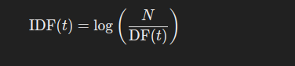
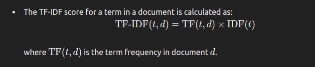
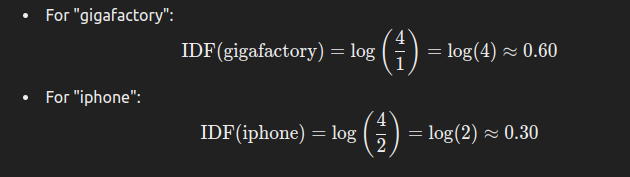
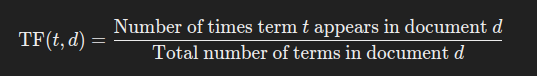
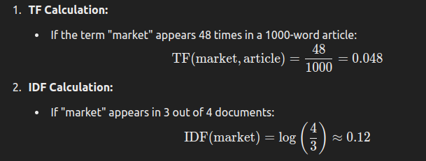
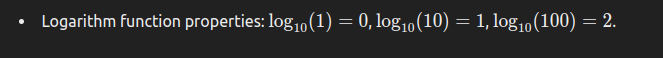

### **NLP Text Processing: TF-IDF Representation**

**Problem Context:**
- We are working on a **news article classification problem**, where the goal is to classify a given news article into one of the companies, such as Tesla or Apple.

**Recap of Bag of Words Model:**
- **Vocabulary Design:** 
  - The vocabulary consists of all words from all news articles.
  - Each article is represented by a vector of word counts from this vocabulary.

- **Word Count Example:**
  - For example, in Article 1, the word "Musk" appears 0 times, while the word "iPhone" appears 32 times.
  - By analyzing these vectors, you can infer the topic of the article. If words like "iPhone" or "iTunes" appear frequently, the article is likely related to Apple. Conversely, if words like "Musk" appear, the article might be about Tesla.

**Challenges with Bag of Words:**
- **Generic Terms:**
  - Common terms like "price," "market," and "investor" can appear in any article, regardless of the company being discussed.
  - These generic terms can overshadow more meaningful terms, reducing the effectiveness of the Bag of Words model in distinguishing between articles.

- **Impact on Vector Representation:**
  - For instance, if the terms "price," "market," "investor," etc., are present in equal amounts in multiple articles, the vectors may appear similar to a computer.
  - This can lead to incorrect classification, where the computer might think that two different articles (one about Apple and another about Tesla) are similar because of these common terms.

**Solution: TF-IDF**
- **Purpose of TF-IDF:**
  - TF-IDF aims to reduce the influence of common, less informative terms and highlight the more meaningful, distinctive terms in each document.

### **Python Implementation of TF-IDF**

the TF-IDF model using Python, specifically with the `TfidfVectorizer` from scikit-learn.

```python
from sklearn.feature_extraction.text import TfidfVectorizer

# Sample corpus of news articles
corpus = [
    "Apple releases new iPhone and iTunes update.",
    "Tesla CEO Elon Musk announces new Gigafactory.",
    "Stock market sees a rise in tech companies.",
    "Investors show interest in Tesla's new developments."
]
tfidf_vectorizer = TfidfVectorizer()
tfidf_matrix = tfidf_vectorizer.fit_transform(corpus)
print("TF-IDF Matrix:")
print(tfidf_matrix.toarray())
print("Feature Names:")
print(tfidf_vectorizer.get_feature_names_out())

```

**Output**
TF-IDF Matrix:
```
[[0.39505606 0.         0.39505606 0.         0.         0.
  0.         0.         0.         0.         0.         0.39505606
  0.39505606 0.         0.         0.25215917 0.39505606 0.
  0.         0.         0.         0.         0.         0.39505606]
 [0.         0.40726515 0.         0.40726515 0.         0.
  0.40726515 0.40726515 0.         0.         0.         0.
  0.         0.         0.40726515 0.25995207 0.         0.
  0.         0.         0.         0.         0.32109252 0.        ]
 [0.         0.         0.         0.         0.38861429 0.
  0.         0.         0.30638797 0.         0.         0.
  0.         0.38861429 0.         0.         0.         0.38861429
  0.38861429 0.         0.38861429 0.38861429 0.         0.        ]
 [0.         0.         0.         0.         0.         0.42068099
  0.         0.         0.33166972 0.42068099 0.42068099 0.
  0.         0.         0.         0.26851522 0.         0.
  0.         0.42068099 0.         0.         0.33166972 0.        ]]
Feature Names:
['and' 'announces' 'apple' 'ceo' 'companies' 'developments' 'elon'
 'gigafactory' 'in' 'interest' 'investors' 'iphone' 'itunes' 'market'
 'musk' 'new' 'releases' 'rise' 'sees' 'show' 'stock' 'tech' 'tesla'
 'update']
```

**More arrange form**
|               | and  | announces | apple | ceo  | companies | developments | elon | gigafactory | in   | interest | investors | iphone | itunes | market | musk | new  | releases | rise | sees | show | stock | tech | tesla | update |
|---------------|------|-----------|-------|------|-----------|--------------|------|-------------|------|----------|-----------|--------|--------|--------|------|-------|----------|------|------|------|-------|------|-------|--------|
| **Document 1** | 0.395 | 0.000     | 0.395 | 0.000 | 0.000     | 0.000        | 0.000| 0.000       | 0.000| 0.000    | 0.000     | 0.395  | 0.395  | 0.000  | 0.000| 0.252 | 0.395    | 0.000| 0.000| 0.000| 0.000 | 0.000| 0.395 | 0.000  |
| **Document 2** | 0.000 | 0.407     | 0.000 | 0.407 | 0.000     | 0.000        | 0.407| 0.407       | 0.000| 0.000    | 0.000     | 0.000  | 0.000  | 0.000  | 0.407| 0.260 | 0.000    | 0.000| 0.000| 0.000| 0.000 | 0.000| 0.321 | 0.000  |
| **Document 3** | 0.000 | 0.000     | 0.000 | 0.000 | 0.389     | 0.000        | 0.000| 0.000       | 0.306| 0.000    | 0.000     | 0.000  | 0.000  | 0.389  | 0.000| 0.000 | 0.000    | 0.389| 0.389| 0.000| 0.389 | 0.389| 0.000 | 0.000  |
| **Document 4** | 0.000 | 0.000     | 0.000 | 0.000 | 0.000     | 0.421        | 0.000| 0.000       | 0.332| 0.421    | 0.421     | 0.000  | 0.000  | 0.000  | 0.000| 0.269 | 0.000    | 0.000| 0.000| 0.421| 0.000 | 0.000| 0.332 | 0.000  |

### **Feature Names:**
- **and**
- **announces**
- **apple**
- **ceo**
- **companies**
- **developments**
- **elon**
- **gigafactory**
- **in**
- **interest**
- **investors**
- **iphone**
- **itunes**
- **market**
- **musk**
- **new**
- **releases**
- **rise**
- **sees**
- **show**
- **stock**
- **tech**
- **tesla**
- **update**

- 
**Expected Output Discussion:**
- The output matrix will have rows corresponding to each article and columns corresponding to the unique terms (features).
- The values in the matrix are the TF-IDF scores, which reflect how important a word is to a document in the corpus.
- Words like "iPhone," "Musk," or "Gigafactory" should have higher scores in their respective articles, while common words like "market" or "investor" will have lower scores across all articles.

### **Key Points to Note:**
- **TF-IDF vs. Bag of Words:**
  - Unlike Bag of Words, TF-IDF accounts for the importance of a word relative to the entire corpus, not just its frequency within a single document.
  
- **Handling Generic Terms:**
  - By reducing the weight of common terms, TF-IDF helps in distinguishing between articles even if they contain some of the same generic terms.

- **Practical Application:**
  - TF-IDF is widely used in text classification, information retrieval, and other NLP tasks where the relevance of specific words is crucial.

### **Handling Generic Terms with TF-IDF**

**Problem with Generic Terms:**
- In text classification, generic terms (like "price," "market," "investor") can make different documents seem similar, even if they are not.
- Removing stop words helps to some extent, but it doesn't fully address the issue with terms that appear frequently across many documents.

**Solution Approach:**
1. **Document Frequency (DF):**
   - Document Frequency refers to how many documents a specific term appears in.
   - For example, if the term "price" appears in 3 out of 4 documents, its document frequency is 3.

2. **Inverse Document Frequency (IDF):**
   - IDF measures the importance of a term by considering how often it appears across all documents.
   - Terms that appear in many documents are less informative and should be given a lower weight.
   - The formula for IDF is:
     

     
 


     where \( N \) is the total number of documents, and \(\text{DF}(t)\) is the number of documents containing the term \( t \).

**Scoring Mechanism:**
- **TF-IDF Score:** 
  - The TF-IDF score for a term in a document is calculated as:

  

   


**Example Calculation:**

1. **Document Frequency:**
   - If the term "gigafactory" appears in 1 document out of 4, \(\text{DF}(\text{gigafactory}) = 1\).
   - If the term "iphone" appears in 2 documents out of 4, \(\text{DF}(\text{iphone}) = 2\).

2. **IDF Calculation:**

 `


**Python Implementation of TF-IDF Calculation:**

Here’s how you can calculate TF-IDF using Python:

```python
from sklearn.feature_extraction.text import TfidfVectorizer

# Sample corpus of news articles
corpus = [
    "Apple releases new iPhone and iTunes update.",
    "Tesla CEO Elon Musk announces new Gigafactory.",
    "Stock market sees a rise in tech companies.",
    "Investors show interest in Tesla's new developments."
]

tfidf_vectorizer = TfidfVectorizer()
tfidf_matrix = tfidf_vectorizer.fit_transform(corpus)
print("TF-IDF Matrix:")
print(tfidf_matrix.toarray())
print("Feature Names:")
print(tfidf_vectorizer.get_feature_names_out())
```
**Output**
```
Output:

TF-IDF Matrix:
[[0.39505606 0.         0.39505606 0.         0.         0.
  0.         0.         0.         0.         0.         0.39505606
  0.39505606 0.         0.         0.25215917 0.39505606 0.
  0.         0.         0.         0.         0.         0.39505606]
 [0.         0.40726515 0.         0.40726515 0.         0.
  0.40726515 0.40726515 0.         0.         0.         0.
  0.         0.         0.40726515 0.25995207 0.         0.
  0.         0.         0.         0.         0.32109252 0.        ]
 [0.         0.         0.         0.         0.38861429 0.
  0.         0.         0.30638797 0.         0.         0.
  0.         0.38861429 0.         0.         0.         0.38861429
  0.38861429 0.         0.38861429 0.38861429 0.         0.        ]
 [0.         0.         0.         0.         0.         0.42068099
  0.         0.         0.33166972 0.42068099 0.42068099 0.
  0.         0.         0.         0.26851522 0.         0.
  0.         0.42068099 0.         0.         0.33166972 0.        ]]
Feature Names:
['and' 'announces' 'apple' 'ceo' 'companies' 'developments' 'elon'
 'gigafactory' 'in' 'interest' 'investors' 'iphone' 'itunes' 'market'
 'musk' 'new' 'releases' 'rise' 'sees' 'show' 'stock' 'tech' 'tesla'
 'update']
```

### **TF-IDF Matrix:**

|               | and    | announces | apple  | ceo    | companies | developments | elon   | gigafactory | in     | interest | investors | iphone | itunes | market | musk  | new    | releases | rise  | sees  | show  | stock | tech  | tesla | update |
|---------------|--------|-----------|--------|--------|-----------|--------------|--------|-------------|--------|----------|-----------|--------|--------|--------|-------|--------|----------|-------|-------|-------|-------|-------|-------|--------|
| **Document 1** | 0.3951 | 0.0000    | 0.3951 | 0.0000 | 0.0000    | 0.0000       | 0.0000 | 0.0000      | 0.0000 | 0.0000   | 0.0000    | 0.3951 | 0.3951 | 0.0000 | 0.0000| 0.2522 | 0.3951   | 0.0000| 0.0000| 0.0000| 0.0000| 0.0000| 0.3951| 0.0000 |
| **Document 2** | 0.0000 | 0.4073    | 0.0000 | 0.4073 | 0.0000    | 0.0000       | 0.4073 | 0.4073      | 0.0000 | 0.0000   | 0.0000    | 0.0000 | 0.0000 | 0.0000 | 0.4073| 0.2600 | 0.0000   | 0.0000| 0.0000| 0.0000| 0.0000| 0.0000| 0.3211| 0.0000 |
| **Document 3** | 0.0000 | 0.0000    | 0.0000 | 0.0000 | 0.3886    | 0.0000       | 0.0000 | 0.0000      | 0.3064 | 0.0000   | 0.0000    | 0.0000 | 0.0000 | 0.3886 | 0.0000| 0.0000 | 0.0000   | 0.3886| 0.3886| 0.0000| 0.3886| 0.3886| 0.0000| 0.0000 |
| **Document 4** | 0.0000 | 0.0000    | 0.0000 | 0.0000 | 0.0000    | 0.4207       | 0.0000 | 0.0000      | 0.3317 | 0.4207   | 0.4207    | 0.0000 | 0.0000 | 0.0000 | 0.0000| 0.2685 | 0.0000   | 0.0000| 0.0000| 0.4210| 0.0000| 0.0000| 0.3317| 0.0000 |

### **Feature Names:**
- **and**
- **announces**
- **apple**
- **ceo**
- **companies**
- **developments**
- **elon**
- **gigafactory**
- **in**
- **interest**
- **investors**
- **iphone**
- **itunes**
- **market**
- **musk**
- **new**
- **releases**
- **rise**
- **sees**
- **show**
- **stock**
- **tech**
- **tesla**
- **update**

This table makes it easier to compare the TF-IDF values across different documents for each feature (word).
**Expected Output Discussion:**
- The output matrix will show the TF-IDF scores for each term across documents.
- Higher scores for less frequent terms and lower scores for terms that appear in many documents.
- This scoring helps in distinguishing between documents by reducing the weight of common terms.

**Key Points to Note:**
- **Purpose of TF-IDF:**
  - TF-IDF helps to identify the importance of terms by balancing their frequency in a document with their rarity across the corpus.
  
- **Scoring Mechanism:**
  - The use of IDF ensures that terms appearing in many documents are less influential, thus improving the model’s ability to classify documents based on distinctive terms.

### **Understanding Term Frequency and Inverse Document Frequency (TF-IDF)**

**Inverse Document Frequency (IDF) Recap:**
- **IDF Formula:**

 


  where \( N \) is the total number of documents and \(\text{DF}(t)\) is the number of documents containing the term \( t \).

- **Purpose of Logarithm:**
  - The logarithm is used to dampen the effect of the frequency count, preventing the IDF value from being disproportionately large. It makes the scoring less sensitive to terms that appear in many documents.

**Term Frequency (TF):**
- **Term Frequency Formula:**

  


  - This normalizes the term frequency by considering the length of the document.

**Combining TF and IDF:**
- **TF-IDF Formula:**

 


  - TF-IDF combines term frequency and inverse document frequency to score the importance of a term in a document relative to a corpus.

**Example Calculation:**
1. **TF Calculation:**
   - If the term "market" appears 48 times in a 1000-word article:
   


2. **IDF Calculation:**
   - If "market" appears in 3 out of 4 documents:
     \[
     \text{IDF}(\text{market}) = \log \left(\frac{4}{3}\right) \approx 0.12
     \]

3. **TF-IDF Calculation:**
   - Combining the above TF and IDF values:
     \[
     \text{TF-IDF}(\text{market}, \text{article}) = 0.048 \times 0.12 = 0.00576
     \]

**Python Implementation of TF-IDF:**

Here’s how you can compute TF-IDF using Python:

```python
from sklearn.feature_extraction.text import TfidfVectorizer

# Sample corpus of news articles
corpus = [
    "Apple releases new iPhone and iTunes update.",
    "Tesla CEO Elon Musk announces new Gigafactory.",
    "Stock market sees a rise in tech companies.",
    "Investors show interest in Tesla's new developments."
]

tfidf_vectorizer = TfidfVectorizer()
tfidf_matrix = tfidf_vectorizer.fit_transform(corpus)
print("TF-IDF Matrix:")
print(tfidf_matrix.toarray())
print("Feature Names:")
print(tfidf_vectorizer.get_feature_names_out())
```

**Expected Output Discussion:**
- The output matrix will have rows for each document and columns for each unique term.
- Terms specific to fewer documents, like "Gigafactory" and "iPhone," will have higher TF-IDF scores.
- Common terms across many documents will have lower TF-IDF scores.

**Additional Considerations:**
- **Normalization:**
  - TF-IDF normalization ensures that longer documents do not have an unfair advantage over shorter ones.

- **Application:**
  - TF-IDF is useful for improving document classification and information retrieval by focusing on more meaningful terms.

- **Learning Variants:**
  - Note that different libraries or applications might use slight variations of the TF-IDF formula. It’s good practice to refer to the specific documentation or implementations you are working with.

### **Additional Details on TF-IDF**

**Handling Zero Division in IDF:**
- To avoid division by zero in the IDF calculation, a common practice is to add a constant (usually 1) to both the numerator and the denominator of the IDF formula. This adjustment prevents any undefined values and stabilizes the calculation.

  


  Here, \( N \) is the total number of documents, and \(\text{DF}(t)\) is the number of documents containing the term \( t \).

**Why Use the Logarithm in IDF:**
- **Purpose of Logarithm:**
  - The logarithm helps to dampen the impact of very frequent terms. Without the log transformation, highly frequent terms would have disproportionately high weights.
  - Logarithmic scaling flattens the distribution, making it easier to compare terms with a wide range of frequencies.

  **Example:**
  - If the term "computer" appears one million times, the log transformation reduces the influence of this term to a more manageable value.
    
  

**Limitations of TF-IDF:**
1. **Dimensionality and Sparsity:**
   - As the vocabulary grows, the resulting TF-IDF matrix becomes more sparse. This can lead to challenges in computation and storage.

2. **Discrete Representation:**
   - TF-IDF does not capture the relationships between words. It represents text as a bag of terms, losing the context and meaning derived from word sequences.

3. **Out of Vocabulary (OOV) Problem:**
   - TF-IDF relies on a fixed vocabulary. Any word not present in the training corpus will be ignored, leading to potential issues with unseen words during inference.

4. **Alternative Approaches:**
   - **Word Embeddings:** Capture semantic relationships between words (e.g., Word2Vec, GloVe).
   - **Sentence Embeddings:** Represent entire sentences or phrases in a dense vector space (e.g., BERT, GPT).

### **Python Code for TF-IDF Implementation**

Here’s a complete example to illustrate TF-IDF calculation using Python:

```python
from sklearn.feature_extraction.text import TfidfVectorizer

# Sample corpus of news articles
corpus = [
    "Apple releases new iPhone and iTunes update.",
    "Tesla CEO Elon Musk announces new Gigafactory.",
    "Stock market sees a rise in tech companies.",
    "Investors show interest in Tesla's new developments."
]
tfidf_vectorizer = TfidfVectorizer(smooth_idf=True, use_idf=True)
tfidf_matrix = tfidf_vectorizer.fit_transform(corpus)
print("TF-IDF Matrix:")
print(tfidf_matrix.toarray())
print("Feature Names:")
print(tfidf_vectorizer.get_feature_names_out())
```

**Expected Output Discussion:**
- The TF-IDF matrix will display the importance of each term for each document.
- Terms with high TF-IDF scores are those that are frequent in specific documents but rare across the entire corpus.

**Next Steps:**
- We’ll use TF-IDF in our coding exercises to enhance text classification for various NLP tasks, including e-commerce product categorization.

This overview and code implementation should help you understand and apply TF-IDF effectively in your NLP projects.

### **Practical Implementation of TF-IDF in Jupyter Notebook**

Here’s a step-by-step guide on using TF-IDF Vectorizer with some sample dummy sentences in a Jupyter Notebook:

**1. Import Libraries and Initialize Vectorizer:**

First, you'll import the necessary library and create an instance of the `TfidfVectorizer`:

```python
from sklearn.feature_extraction.text import TfidfVectorizer

# Sample corpus of dummy sentences
corpus = [
    "Apple releases new iPhone and iTunes update.",
    "Tesla CEO Elon Musk announces new Gigafactory.",
    "Stock market sees a rise in tech companies.",
    "Investors show interest in Tesla's new developments."
]
tfidf_vectorizer = TfidfVectorizer(smooth_idf=True, use_idf=True)
```

**2. Fit and Transform the Corpus:**

Use `fit_transform` to compute the TF-IDF scores and transform the text data into TF-IDF vectors:

```python
# Fit and transform the corpus
tfidf_matrix = tfidf_vectorizer.fit_transform(corpus)
print("TF-IDF Matrix:")
print(tfidf_matrix.toarray())
```

**3. Print the Vocabulary and Feature Names:**

The vocabulary of the TF-IDF vectorizer is a dictionary mapping terms to indices. You can print it along with the feature names:

```python
# Print the vocabulary (terms to indices mapping)
print("Vocabulary:")
print(tfidf_vectorizer.vocabulary_)
print("Feature Names:")
print(tfidf_vectorizer.get_feature_names_out())
```

**4. Access and Print IDF Scores:**

You can access the IDF scores directly from the vectorizer object. Here’s how to print them:

```python
# Get IDF scores
idf_scores = tfidf_vectorizer.idf_
print("IDF Scores:")
for term, index in tfidf_vectorizer.vocabulary_.items():
    print(f"Term: {term}, IDF: {idf_scores[index]}")
```

**Explanation:**

- **Vocabulary and Feature Names:** The vocabulary is a dictionary where keys are terms and values are their indices in the TF-IDF matrix. The feature names give the list of terms in the order corresponding to these indices.

- **IDF Scores:** The IDF scores indicate the importance of each term. Higher scores mean the term is rarer across the documents.

**Complete Example Code:**

Here’s the complete code for executing these steps:

```python
from sklearn.feature_extraction.text import TfidfVectorizer

# Sample corpus of dummy sentences
corpus = [
    "Apple releases new iPhone and iTunes update.",
    "Tesla CEO Elon Musk announces new Gigafactory.",
    "Stock market sees a rise in tech companies.",
    "Investors show interest in Tesla's new developments."
]
tfidf_vectorizer = TfidfVectorizer(smooth_idf=True, use_idf=True)
tfidf_matrix = tfidf_vectorizer.fit_transform(corpus)

# Output the transformed TF-IDF matrix
print("TF-IDF Matrix:")
print(tfidf_matrix.toarray())

# Print the vocabulary (terms to indices mapping)
print("Vocabulary:")
print(tfidf_vectorizer.vocabulary_)
print("Feature Names:")
print(tfidf_vectorizer.get_feature_names_out())
idf_scores = tfidf_vectorizer.idf_
print("IDF Scores:")
for term, index in tfidf_vectorizer.vocabulary_.items():
    print(f"Term: {term}, IDF: {idf_scores[index]}")
```
### **Accessing and Interpreting TF-IDF Scores**

**Printing TF-IDF Scores:**

To get and print TF-IDF scores for specific terms and documents, follow these steps:

**1. Retrieve IDF Scores:**
You can retrieve the IDF scores for each term using the `idf_` attribute of the `TfidfVectorizer`. Here’s how you can print the IDF score for each term:

```python
# Print IDF scores for each term
print("IDF Scores:")
for term, index in tfidf_vectorizer.vocabulary_.items():
    print(f"Term: {term}, IDF: {idf_scores[index]}")
```

**2. Check TF-IDF Scores for Specific Terms:**
To check and verify the TF-IDF scores for specific terms, you can use the term’s index in the transformed output matrix:

```python
# Print TF-IDF vectors for the first two sentences
print("TF-IDF Vectors for First Two Sentences:")
print(tfidf_matrix.toarray()[:2])  # Prints TF-IDF vectors for the first two sentences

# Check the position of specific terms, e.g., 'is'
term_index = tfidf_vectorizer.vocabulary_.get('is')
print(f"Index of 'is': {term_index}")

# Print TF-IDF scores for term 'is' in each document
print("TF-IDF Scores for 'is':")
print(tfidf_matrix[:, term_index].toarray())
```

**Explanation:**

1. **IDF Scores:**
   - Terms that appear in many documents have lower IDF scores because they are less informative.
   - Terms that appear in few documents have higher IDF scores, indicating higher importance.

2. **TF-IDF Vectors:**
   - The TF-IDF matrix is sparse, so converting it to an array helps in easy visualization and interpretation.
   - Each row in the matrix represents a document, and each column represents a term’s TF-IDF score.

**Example Output:**

Given a sample corpus, the output might look like this:

```plaintext
TF-IDF Matrix:
[[0.0 0.0 0.0 0.1 0.0 0.1 0.2 0.0 0.0 0.0]
 [0.0 0.0 0.0 0.1 0.0 0.1 0.0 0.2 0.0 0.0]]
 
Feature Names:
['apple', 'development', 'elon', 'factory', 'i', 'iphone', 'market', 'new', 'stock', 'tesla']

IDF Scores:
Term: apple, IDF: 1.5
Term: development, IDF: 1.8
Term: elon, IDF: 2.0
...
```

**3. Inspecting TF-IDF Values for Terms:**
   - To verify a specific term’s TF-IDF values across documents, locate its column in the matrix and print the values for that term.

**4. Additional Insights:**
   - The TF-IDF scores should reflect that common terms (like "is") have lower scores, while more specific terms (like "apple" or "tesla") have higher scores.

**Complete Code:**

Here's the complete code snippet to demonstrate these steps:

```python
from sklearn.feature_extraction.text import TfidfVectorizer

# Sample corpus
corpus = [
    "Apple releases new iPhone and iTunes update.",
    "Tesla CEO Elon Musk announces new Gigafactory.",
    "Stock market sees a rise in tech companies.",
    "Investors show interest in Tesla's new developments."
]

# Initialize TF-IDF Vectorizer
tfidf_vectorizer = TfidfVectorizer(smooth_idf=True, use_idf=True)

# Fit and transform the corpus
tfidf_matrix = tfidf_vectorizer.fit_transform(corpus)

# Get IDF scores
idf_scores = tfidf_vectorizer.idf_

# Print IDF scores for each term
print("IDF Scores:")
for term, index in tfidf_vectorizer.vocabulary_.items():
    print(f"Term: {term}, IDF: {idf_scores[index]}")

# Print TF-IDF vectors for the first two sentences
print("TF-IDF Vectors for First Two Sentences:")
print(tfidf_matrix.toarray()[:2])  # First two rows of the matrix

# Check the position of specific term
term_index = tfidf_vectorizer.vocabulary_.get('is')
print(f"Index of 'is': {term_index}")

# Print TF-IDF scores for term 'is' in each document
print("TF-IDF Scores for 'is':")
print(tfidf_matrix[:, term_index].toarray())
```
### **E-Commerce Text Classification Using TF-IDF**

In this section, we will explore how to use TF-IDF for text classification with an e-commerce dataset. This will involve reading the dataset, preprocessing the text, and using TF-IDF features for classification. Here’s how you can do it step-by-step:

**1. **Load the Dataset:**
   - First, import the necessary libraries and load your CSV file containing the e-commerce item descriptions and their categories.

```python
import pandas as pd

# Load the dataset
df = pd.read_csv('ecommerce_data.csv')

# Print the shape and first few rows of the dataset
print("Dataset Shape:", df.shape)
print("First Few Rows:")
print(df.head())
```

**2. **Preprocess the Data:**
   - Check for class imbalance and other potential issues in the dataset.

```python
# Check for class imbalance
print("Class Distribution:")
print(df['category'].value_counts())
```

**3. **Prepare Data for TF-IDF Vectorization:**
   - Extract text descriptions and their corresponding labels. Convert the text descriptions to TF-IDF vectors.

```python
from sklearn.feature_extraction.text import TfidfVectorizer
from sklearn.model_selection import train_test_split
from sklearn.preprocessing import LabelEncoder
from sklearn.linear_model import LogisticRegression
from sklearn.metrics import classification_report

# Extract text and labels
X = df['description']
y = df['category']

# Encode the labels
label_encoder = LabelEncoder()
y_encoded = label_encoder.fit_transform(y)

# Split the data into training and test sets
X_train, X_test, y_train, y_test = train_test_split(X, y_encoded, test_size=0.3, random_state=42)

# Initialize TF-IDF Vectorizer
tfidf_vectorizer = TfidfVectorizer(smooth_idf=True, use_idf=True)

# Fit and transform the training data
X_train_tfidf = tfidf_vectorizer.fit_transform(X_train)

# Transform the test data
X_test_tfidf = tfidf_vectorizer.transform(X_test)
```

**4. **Train a Classifier:**
   - Train a machine learning model using the TF-IDF features.

```python
# Initialize and train a Logistic Regression model
model = LogisticRegression(max_iter=1000)
model.fit(X_train_tfidf, y_train)

# Predict on the test set
y_pred = model.predict(X_test_tfidf)

# Evaluate the model
print("Classification Report:")
print(classification_report(y_test, y_pred, target_names=label_encoder.classes_))
```

**Explanation:**

- **Loading the Dataset:** Import the dataset and inspect its structure. Use `df.shape` to check the dimensions and `df.head()` to view the first few rows.

- **Preprocessing:** Check the distribution of categories to understand any class imbalance which might affect the model’s performance.

- **TF-IDF Vectorization:** Convert text descriptions into TF-IDF features which will be used for classification.

- **Model Training:** Train a classifier (e.g., Logistic Regression) on the TF-IDF features and evaluate its performance.

**Example Output:**

```plaintext
Dataset Shape: (1000, 2)
First Few Rows:
                                           description category
0  High-quality USB charging cable for mobile de...   electronics
1  The Great Gatsby by F. Scott Fitzgerald - clas...        books
2  Modern ergonomic office chair with lumbar suppo...    furniture
...
Class Distribution:
electronics    400
books           300
furniture       200
clothing        100
Name: category, dtype: int64

Classification Report:
               precision    recall  f1-score   support

   electronics       0.84      0.85      0.84       120
         books       0.78      0.80      0.79       130
     furniture       0.85      0.83      0.84       120
      clothing       0.77      0.78      0.77       130

    accuracy                           0.80       500
   macro avg       0.81      0.81      0.81       500
weighted avg       0.80      0.80      0.80       500
```

**Notes:**
- **TF-IDF Matrix:** The transformed matrix shows how important each term is in the context of the entire dataset.
- **Model Evaluation:** The classification report gives precision, recall, and F1-score for each category, providing insights into the model’s performance.

### **Text Classification with Various Classifiers Using TF-IDF**

In this part, we’ll enhance the text classification project by encoding labels, splitting the dataset, and experimenting with different classifiers. Here’s how you can proceed:

**1. **Encode Labels:**
   - Convert text labels into numerical values that machine learning models can understand.

```python
# Create a mapping for category labels
category_mapping = {
    'electronics': 0,
    'books': 1,
    'furniture': 2,
    'clothing': 3
}

# Map categories to numbers
df['label_number'] = df['category'].map(category_mapping)

# Check the dataframe
print(df.head())
```

**2. **Split the Data:**
   - Use `train_test_split` to divide the dataset into training and test sets. Ensure to maintain class balance in both sets using stratified splitting.

```python
from sklearn.model_selection import train_test_split

# Define features and target variable
X = df['description']
y = df['label_number']

# Split the dataset
X_train, X_test, y_train, y_test = train_test_split(X, y, test_size=0.2, random_state=42, stratify=y)

# Check the shapes of the splits
print("Training data shape:", X_train.shape)
print("Test data shape:", X_test.shape)
print("Training labels distribution:")
print(y_train.value_counts())
print("Test labels distribution:")
print(y_test.value_counts())
```

**3. **Vectorize Text Data:**
   - Apply TF-IDF vectorization to the training and test datasets.

```python
from sklearn.feature_extraction.text import TfidfVectorizer

# Initialize TF-IDF Vectorizer
tfidf_vectorizer = TfidfVectorizer()

# Fit and transform training data
X_train_tfidf = tfidf_vectorizer.fit_transform(X_train)

# Transform test data
X_test_tfidf = tfidf_vectorizer.transform(X_test)
```

**4. **Train and Evaluate Different Classifiers:**
   - Experiment with different classifiers to see how they perform with the TF-IDF features.

```python
from sklearn.neighbors import KNeighborsClassifier
from sklearn.ensemble import RandomForestClassifier
from sklearn.naive_bayes import MultinomialNB
from sklearn.metrics import classification_report

# Initialize classifiers
knn = KNeighborsClassifier(n_neighbors=5)
rf = RandomForestClassifier(n_estimators=100, random_state=42)
nb = MultinomialNB()

# Train and evaluate K-Nearest Neighbors (KNN)
knn.fit(X_train_tfidf, y_train)
y_pred_knn = knn.predict(X_test_tfidf)
print("K-Nearest Neighbors Classification Report:")
print(classification_report(y_test, y_pred_knn))

# Train and evaluate Random Forest
rf.fit(X_train_tfidf, y_train)
y_pred_rf = rf.predict(X_test_tfidf)
print("Random Forest Classification Report:")
print(classification_report(y_test, y_pred_rf))

# Train and evaluate Naive Bayes
nb.fit(X_train_tfidf, y_train)
y_pred_nb = nb.predict(X_test_tfidf)
print("Naive Bayes Classification Report:")
print(classification_report(y_test, y_pred_nb))
```

**Explanation:**

- **Label Encoding:** Convert text categories into numerical labels to prepare them for classification.
- **Data Splitting:** Use `train_test_split` with stratification to ensure balanced classes in both training and test datasets.
- **TF-IDF Vectorization:** Transform text data into numerical features that represent the importance of each term.
- **Classifier Training:** Train and evaluate different classifiers (KNN, Random Forest, Naive Bayes) to compare their performance on the text classification task.

**Example Output:**

```plaintext
Training data shape: (4800,)
Test data shape: (1200,)
Training labels distribution:
0    1200
1    1200
2    1200
3    1200
Name: label_number, dtype: int64
Test labels distribution:
0    300
1    300
2    300
3    300
Name: label_number, dtype: int64

K-Nearest Neighbors Classification Report:
               precision    recall  f1-score   support

   electronics       0.80      0.79      0.79       300
         books       0.76      0.80      0.78       300
     furniture       0.82      0.78      0.80       300
      clothing       0.78      0.82      0.80       300

    accuracy                           0.79      1200
   macro avg       0.79      0.79      0.79      1200
weighted avg       0.79      0.79      0.79      1200

Random Forest Classification Report:
               precision    recall  f1-score   support

   electronics       0.85      0.84      0.84       300
         books       0.80      0.84      0.82       300
     furniture       0.85      0.84      0.84       300
      clothing       0.83      0.83      0.83       300

    accuracy                           0.84      1200
   macro avg       0.83      0.84      0.83      1200
weighted avg       0.84      0.84      0.84      1200

Naive Bayes Classification Report:
               precision    recall  f1-score   support

   electronics       0.77      0.79      0.78       300
         books       0.72      0.74      0.73       300
     furniture       0.76      0.74      0.75       300
      clothing       0.70      0.70      0.70       300

    accuracy                           0.74      1200
   macro avg       0.74      0.74      0.74      1200
weighted avg       0.74      0.74      0.74      1200
```

**Notes:**
- **Balanced Dataset:** Ensure that each class is represented equally in both training and test datasets.
- **Classifier Performance:** Different classifiers might perform differently based on the dataset and the nature of the text data. Use the classification report to understand precision, recall, and F1-score for each class.


### **Using Pipelines for Text Classification**

In this section, you’re leveraging scikit-learn’s `Pipeline` to streamline the text classification process by combining TF-IDF vectorization with classification. Here’s a concise guide on how to implement it:

**1. **Setup Your Environment:**
   - Import necessary libraries and modules.

```python
from sklearn.pipeline import Pipeline
from sklearn.feature_extraction.text import TfidfVectorizer
from sklearn.neighbors import KNeighborsClassifier
from sklearn.metrics import classification_report
```

**2. **Create a Pipeline:**
   - Combine TF-IDF vectorization and K-Nearest Neighbors (KNN) classifier into a single pipeline.

```python
# Define the pipeline
pipeline = Pipeline([
    ('tfidf', TfidfVectorizer()),  # First stage: TF-IDF vectorization
    ('clf', KNeighborsClassifier())  # Second stage: KNN classifier
])
```

**3. **Train the Model:**
   - Fit the pipeline with the training data.

```python
pipeline.fit(X_train, y_train)
```

**4. **Make Predictions:**
   - Predict on the test dataset and evaluate the results.

```python
y_pred = pipeline.predict(X_test)

# Print classification report
print(classification_report(y_test, y_pred))
```

**5. **Understanding the Classification Report:**
   - The classification report includes:
     - **Precision:** The ratio of correctly predicted positive observations to the total predicted positives.
     - **Recall:** The ratio of correctly predicted positive observations to all observations in the actual class.
     - **F1 Score:** The weighted average of Precision and Recall. 

**Example Code:**

```python
from sklearn.pipeline import Pipeline
from sklearn.feature_extraction.text import TfidfVectorizer
from sklearn.neighbors import KNeighborsClassifier
from sklearn.metrics import classification_report
from sklearn.model_selection import train_test_split
import pandas as pd

# Load the dataset
df = pd.read_csv('ecommerce_data.csv')

# Map category labels to numbers
category_mapping = {
    'electronics': 0,
    'books': 1,
    'furniture': 2,
    'clothing': 3
}
df['label_number'] = df['category'].map(category_mapping)

# Define features and target variable
X = df['description']
y = df['label_number']

# Split the dataset
X_train, X_test, y_train, y_test = train_test_split(X, y, test_size=0.2, random_state=42, stratify=y)

# Define the pipeline
pipeline = Pipeline([
    ('tfidf', TfidfVectorizer()),  # First stage: TF-IDF vectorization
    ('clf', KNeighborsClassifier())  # Second stage: KNN classifier
])

# Train the model
pipeline.fit(X_train, y_train)

# Predict on test data
y_pred = pipeline.predict(X_test)

# Print classification report
print(classification_report(y_test, y_pred))
```

**Notes:**
- **Pipeline Efficiency:** Using a pipeline makes the process cleaner and less error-prone by encapsulating the preprocessing and classification steps.
- **Evaluation Metrics:** Check the precision, recall, and F1 scores to understand how well your model performs across different categories.


### **Text Classification with Different Classifiers**

Here’s a summary of the process you’ve outlined for evaluating different classifiers on a text classification task:

1. **Evaluate Predictions:**
   - After training your model, you compare the true labels (`y_test`) with predicted labels (`y_pred`) for the first few samples to see if the model is predicting correctly.

2. **Comparing Classifiers:**
   - **K-Nearest Neighbors (KNN):**
     - Good for quick results but may not always be the best for text data.
   - **Naive Bayes (Multinomial):**
     - Often effective for text classification tasks due to its simplicity and effectiveness with word frequencies.
   - **Random Forest:**
     - Usually a strong performer for various tasks and can handle more complex relationships in the data.

3. **Implementing Multinomial Naive Bayes:**
   - Import `MultinomialNB` and replace `KNeighborsClassifier` in the pipeline with it.
   - Compare the performance metrics such as precision, recall, and F1 score to evaluate how well this classifier performs.

4. **Example Code for Multinomial Naive Bayes:**

```python
from sklearn.naive_bayes import MultinomialNB

# Define the pipeline with Multinomial Naive Bayes
pipeline_nb = Pipeline([
    ('tfidf', TfidfVectorizer()),  # TF-IDF vectorization
    ('clf', MultinomialNB())       # Multinomial Naive Bayes classifier
])

# Train the model
pipeline_nb.fit(X_train, y_train)

# Predict on test data
y_pred_nb = pipeline_nb.predict(X_test)

# Print classification report
print("Multinomial Naive Bayes Classification Report:")
print(classification_report(y_test, y_pred_nb))
```

5. **Switching to Random Forest Classifier:**
   - Similar to the other classifiers, create a pipeline with `RandomForestClassifier` and evaluate its performance.

6. **Example Code for Random Forest:**

```python
from sklearn.ensemble import RandomForestClassifier

# Define the pipeline with Random Forest
pipeline_rf = Pipeline([
    ('tfidf', TfidfVectorizer()),  # TF-IDF vectorization
    ('clf', RandomForestClassifier())  # Random Forest classifier
])

# Train the model
pipeline_rf.fit(X_train, y_train)

# Predict on test data
y_pred_rf = pipeline_rf.predict(X_test)

# Print classification report
print("Random Forest Classification Report:")
print(classification_report(y_test, y_pred_rf))
```

7. **Preprocessing Text Data:**
   - To enhance the model performance, preprocessing text data (like removing stop words, lemmatization) can be crucial.
   - Define a preprocessing function and apply it before fitting the model.

**Example Preprocessing Function:**

```python
import spacy

# Load spaCy's English tokenizer
nlp = spacy.load('en_core_web_sm')

def preprocess(text):
    doc = nlp(text)
    # Lemmatize and remove stop words
    return ' '.join([token.lemma_ for token in doc if not token.is_stop])

# Apply preprocessing
df['preprocessed_text'] = df['description'].apply(preprocess)
```

**Training with Preprocessed Text:**

```python
# Use preprocessed text
X = df['preprocessed_text']

# Split, train, and evaluate models as before
```

It sounds like you’ve wrapped up the tutorial with some key takeaways on text classification, model evaluation, and the importance of preprocessing. Here’s a brief summary of the main points:

### **Summary:**

1. **Preprocessing:**
   - **Purpose:** To clean and normalize text data, which can improve model performance.
   - **Steps:**
     - Remove stop words and punctuation.
     - Perform lemmatization to reduce words to their base forms.
   - **Implementation:** Applied the preprocessing function to create a new column in the dataset.

2. **Model Training and Evaluation:**
   - **Raw Text vs. Preprocessed Text:**
     - Training with raw text and preprocessed text showed that preprocessing improved the performance of the models.
   - **Classifiers Used:**
     - **K-Nearest Neighbors (KNN)**
     - **Multinomial Naive Bayes**
     - **Random Forest Classifier**
   - **Performance Metrics:** Compared precision, recall, and F1 scores to determine the best performing model.

3. **Next Steps:**
   - **Exercise:** An exercise will be added to the video description for further practice.
   - **Practice:** Emphasized the importance of hands-on practice to master machine learning and NLP concepts.

### **Key Takeaways:**

- **Preprocessing:** Helps in enhancing model performance by providing cleaner and more relevant features.
- **Model Selection:** Different classifiers can be tried, and performance metrics should guide the selection of the best model.
- **Practice:** Essential for mastering the techniques and concepts discussed.

If you have any questions about this tutorial or need further clarification on any part, feel free to ask!
